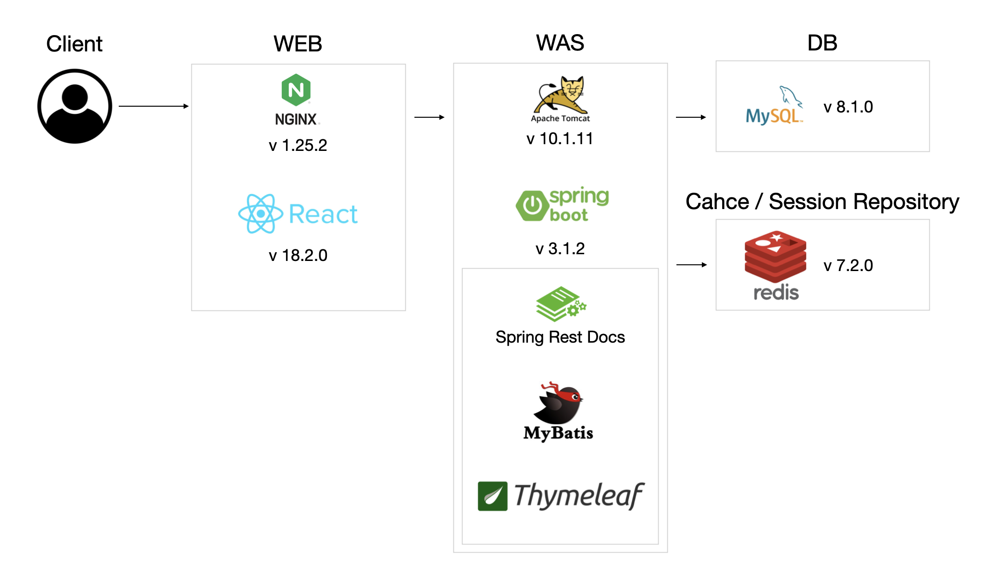

# HomeTown League(우리동네리그)

전국의 아마추어 스포츠동호회를 위한 매칭 플랫폼입니다.
 
단순 매칭에 그치지 않고, 입력된 경기결과를 기반으로 각팀의 랭크를 측정하여 제공합니다.
 
 
온라인게임(LOL, 오버워치 등)을 즐기는 유저들이라면 공감하겠지만, 랭크가 있는 랭크게임과 랭크가 없는 일반게임의 몰입도 차이는 무시할 수 없습니다.
 
스포츠 동호회에 랭크를 도입하여 더 몰입도 있게 즐길 수 있도록 하고자 합니다.

## 링크

| 링크                                             | 설명             |
|------------------------------------------------|----------------|
| [우리 동네 리그](http://218.232.175.4:49155)         | 우리동네리그 서비스에 접속 |
| [API](http://218.232.175.4:49156/rest/docs.do) | API 명세서        |

## 팀원
|이름|역할| github|
|---|---|---|
|전영주|Front-End 개발|  |
|이경훈|Back-End 개발|  |

## 시스템 구조도

## 화면설계
- [화면설계](https://www.figma.com/file/bjqo9hgQBbuflPYZ72ybpo/HomeTownLeague-%EA%B0%84%EB%8B%A8-%EC%99%80%EC%9D%B4%EC%96%B4%ED%94%84%EB%A0%88%EC%9E%84?type=design&node-id=0%3A1&mode=design&t=FnWuJ4wK3mXiBTHG-1) 는 Figma를 사용했습니다.

## ERD
- ERD는 dbdiagram을 사용해 작성했습니다.
- 각 테이블/컬럼의 코멘트는 [ERD](https://dbdiagram.io/d/HomeTownLeague-6562efe33be1495787bd843f) 를 참고하세요.
- 이미지 캡처본은 다음과 같습니다.
  

