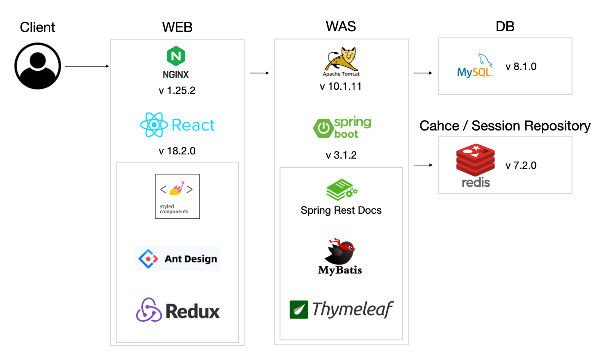
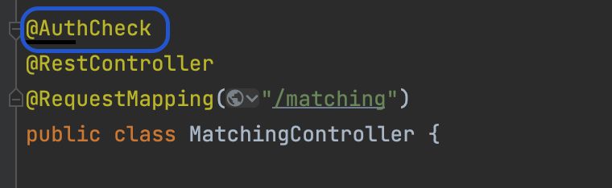
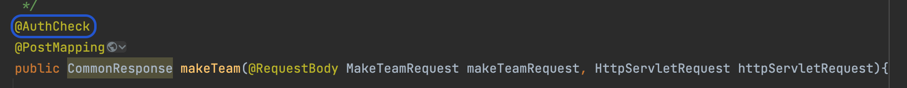
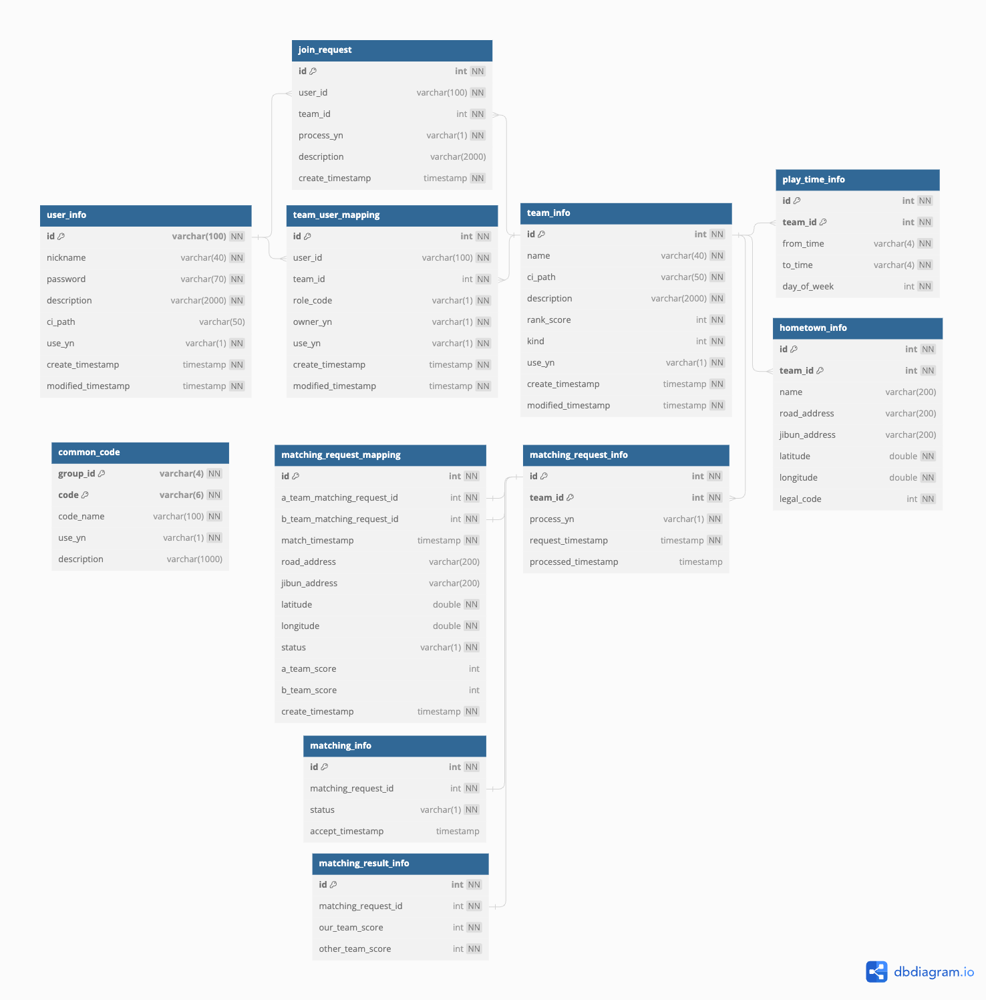

<!--<div align=center> 


</div>
-->

# HomeTown League(우리동네리그) (2023.08 ~ 2023.11)

전국의 아마추어 스포츠동호회를 위한 `매칭 플랫폼`입니다.
<br>
단순 매칭에 그치지 않고, 입력된 경기결과를 기반으로 각팀의 `랭크`를 측정하여 제공합니다.
<br>
<br>
온라인게임(LOL, 오버워치 등)을 즐기는 유저들이라면 공감하겠지만, 랭크가 있는 랭크게임과 랭크가 없는 일반게임의 몰입도 차이는 무시할 수 없습니다.
<br>
스포츠 동호회에 랭크를 도입하여 더 몰입도 있게 즐길 수 있도록 하고자 합니다.
<br>
<br>
자세한 `Business Rule` 및 `고민`은 [WIKI](https://github.com/HometownLeague/hometown-league-be/wiki) 에서 확인할 수 있습니다.

## 링크

| 링크                                                                | 설명                          |
|-------------------------------------------------------------------|-----------------------------|
| [우리 동네 리그](http://218.232.175.4:49155)                            | 우리동네리그 서비스에 접속              |
| [API](http://218.232.175.4:49156/rest/docs.do)                    | API 명세서                     |
| [Front End](https://github.com/HometownLeague/hometown-league-fe) | Front End Github Repository |

## 멤버
| 이름  | 역할           | github                                                                                                                                             |
|-----|--------------|----------------------------------------------------------------------------------------------------------------------------------------------------|
| 전영주 | Front-End 개발 | <a href="https://github.com/Jeon-YJ1004"></a> |
| 이경훈 | Back-End 개발  | <a href="https://github.com/pongdangx2"></a>  |

## 시스템 구조 및 기술 스택
### 사용 기술
Java, Spring Boot, Mybatis, Spring Rest Docs, React, Thymeleaf

### 환경 및 미들웨어
Nginx, Tomcat, MySQL, Redis

### 구조도


## 주요 사항
### Session Clustering
- 분산 환경에서 `Session 정합성`을 유지하고 `Scale Out`에 유리하게 하기 위해 `Redis`에 `Session 정보`를 관리했습니다.
- Redis를 활용해 간단히 세션을 관리할 수 있는 `Spring Session Data Redis` 대신 `Interceptor`와 `Custom Annotation`을 활용해 직접 개발하는 방법을 택했습니다.

#### Session 생성 및 파기
- 로그인 시 `사용자 ID`와 `타임스탬프`의 해시값을 `Key`로 세션 정보를 `Redis`에 저장했습니다.
- 세션은 로그아웃 시 혹은 30분동안 갱신되지 않았을 시 파기됩니다.

#### Session Interceptor
- Sesison 처리가 필요한 API 호출 시 Session을 확인하는 `Interceptor`를 만들었습니다.
- 다음과 같이 `AuthCheck`라는 이름의 `Custom Annotation`을 만들어 이 애노테이션이 붙어있는 Method/Controller 호출 시 Session Interceptor에서 세션을 확인합니다.
> `class`에 세션 체크 적용
> 

> `Method`에 세션 체크 적용
> 

### 매칭 서비스
- 팀의 주장이 매칭을 요청하면 `Redis`에 있는 매칭 대기열에 매칭 요청 데이터를 생성하고, RDB에도 저장합니다. 
- `@Scheduled`애노테이션을 활용해 대기열에 있는 매칭 요청들 중 시간, 장소, 랭크가 비슷한 요청들을 매칭시켰습니다.

### 랭크 서비스
- 랭크 계산은 [ELO Rating](https://ko.wikipedia.org/wiki/%EC%97%98%EB%A1%9C_%ED%8F%89%EC%A0%90_%EC%8B%9C%EC%8A%A4%ED%85%9C) 을 사용했습니다.
- 단 승리 시 점수가 너무 조금 올랐을 때의 허무함을 방지하기 위해 점수가 오를 땐 최소 5점 이상 오르도록 했습니다.

#### 성능 향상 
- 전체 팀의 랭킹을 Redis의 Sorted Set에 캐싱하는 방법을 고려했으나, 경기 끝날 때마다 `자주 수정`되는 랭크의 특성 상 `부적합`하다고 판단했습니다.
- 사용여부가 Y인 팀의 점수를 기반으로 정렬하면 되기 때문에 다음과 같이 `Composite Index`를 만들었습니다.
```sql
create index idx_team_score on team_info (use_yn, rank_score desc);
```
- 그 결과 테스트 데이터 `약 10804개의 팀` 중 상위 `30개`의 팀을 조회했을 때, 소요시간이 `114ms` 에서 `86ms` 로 `약 25%` 줄었습니다.
- 실행계획은 다음과 같습니다.

| 구분        | 소요시간   | id  |select_type|table| partitions |type| possible_keys  | key            | key_len | ref   |rows|filtered| Extra                       |
|-----------|--------|-----|---|---|------------|---|----------------|----------------|---------|-------|---|---|-----------------------------|
| Index생성 전 | 144ms| 1   | SIMPLE |team_info|            |ALL|                |                |         |       |10804|10| Using where; Using filesort |
|Index생성 후|86ms|1|SIMPLE|team_info|            | ref        | idx_team_score | idx_team_score | 6       | const |5402|100|                             |

- Index를 생성하기 전에는 약 10000개의 전체 데이터를 가져온 뒤에 where조건으로 범위를 축소했습니다.
- 또, Filesort로 정렬을 처리했음을 알 수 있습니다.
- Index적용 후에는 처음 가져오는 행의 수가 절반으로 줄은 모습을 볼 수있었습니다.

## 화면설계서
- [화면설계](https://www.figma.com/file/bjqo9hgQBbuflPYZ72ybpo/HomeTownLeague-%EA%B0%84%EB%8B%A8-%EC%99%80%EC%9D%B4%EC%96%B4%ED%94%84%EB%A0%88%EC%9E%84?type=design&node-id=0%3A1&mode=design&t=FnWuJ4wK3mXiBTHG-1) 는 Figma를 사용했습니다.

## ERD
- ERD는 dbdiagram을 사용해 작성했습니다.
- 각 테이블/컬럼의 코멘트는 [ERD](https://dbdiagram.io/d/HomeTownLeague-6562efe33be1495787bd843f) 를 참고하세요.
- 이미지 캡처본은 다음과 같습니다.
  


